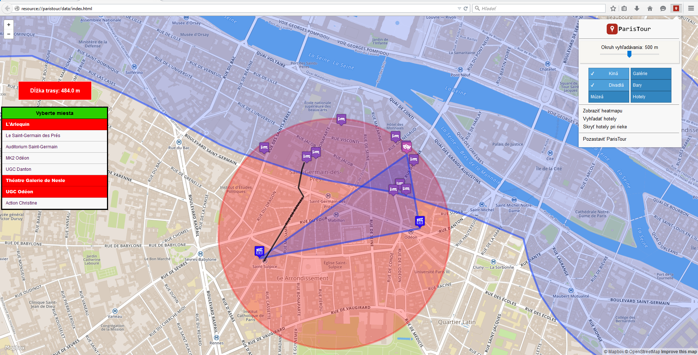

# Overview

Aplikácia nachádza zaujímavé miesta v Paríži. Dôležitými súčasťami aplikácie sú:

- vyhľadanie zaujímavých miest v rámci zvoleného okruhu,

- vyhľadanie najvyhovujúcejších hotelov pre vybraté miesta,

- zobrazenie trasy medzi zvolenými miestami,

- zobrazenie heatmapy a voľba možnosti bývania pri rieke Seina

Screenshot apikácie:



Aplikácia má dve časti, klientská časť predstavuje [frontend](#frontend), využíva mapbox API and mapbox.js a [backend](#backend) napísaný v [Spring Framework](https://spring.io/), s využitím PostGIS. Frontend aplikácie komunikuje s backendom použitím [REST API](#api).

# Frontend

Frontend aplikácie (klientská časť) predstavuje rozšírenie do prehliadača Mozilla Firefox. Frontend zobrazuje informácie, ktoré používateľ požaduje - teda zaujímavé miesta v Paríži a možnosti k nim a vykonáva príslušné udalosti definované používateľom, rovnako tiež volá REST služby poskytované backendom.
Skript (`index.js`) slúži pre prepojenie/ komunikáciu rozšírenia a samotnej stránky, na ktorej je zobrazená mapa. 
Rozhranie rozšírenia je definované v (`panel.html`), štýlované použitím (`panel.css`) a reakcie na samotnú funkcionalitu sú implementované v (`panel.js`) 
Okno, v ktorom je zobrazená mapa je definované v (`index.html`) a štýlované s (`index.css`).
Logika frontendu, teda správanie pri zachytení jednotlivých eventov je implementované (`app.js`), kde sú tiež implementované volania REST služieb backendu.
Informácie sa na mapu pridávajú v podobe vrstiev ako sú vrstva pre okruh hľadania, vrstva pre heat mapu, vrstva pre rieku, vrstvy pre zobrazené zaujímavé miesta a vrstva pre zobrazenie ciest.  


# Backend

Backend aplikácie je napísaný v Java Spring Frameworku, je zodpovedný za dopytovanie geografických dát z databázy použitím SELECT dopytovacích príkazov, formátovanie týchto dát do formátu GeoJSON a poskytovanie týchto dát pre frontend aplikácie.

## Data

Dáta pochádzajú z Mapzen - Metro Extracts. Pre získanie dát Paríža bolo potrebné na tejto stránke vybrať požadovanú oblasť, následne bolo potrebné počkať 30-60 minút, kým boli dáta pripravené na stiahnutie. Veľkosť dát je 34 MB a do databázy boli nahraté pomocou `osm2pgsql` pre zrýchlenie jednotlivých dopytov som vytvoril index na niektoré stĺpce tabuliek databázy, pri ktorých bolo možne s takýmto vylepšením pozorovať zmenu v rýchlosti dopytovania. Dáta do formátu GeoJSON sú generované pomocou štandardnej `ST_AsGeoJSON` funkcie.
Ďalšie používané funkcie sú `row_to_json`, `ST_Contains`, `ST_Buffer`, `ST_MakePoint`, , `ST_Transform` , `ST_MakeLine`, `ST_MakePolygon`, `ST_GeomFromText`, `ST_Union`, `ST_Intersection`, `ST_IsEmpty`, `ST_Within`.

## Api

**Nájdenie zaujímavých miest podľa výberu používateľa**

- Získa dáta o všetkých zaujímavých miestach z kategórií, ktoré používateľ vybral

`POST /showSelectedData`

**Nájdenie najvyhovujúcejších hotelov pre vybraté zaujímavé miesta**

`POST /findHotels`

Podla toho, koľko zaujímavých miest používateľ vybral pre navštívenie metóda:

 - Ak používateľ vybral jedno zaujímavé miesto, získame informácie o najbližšom hotely/ najbližších hoteloch k tomuto miestu, a tiež informácie o okruhu, v ktorom bol tento hotel nájdený (polygon), veľkosť okruhu, v ktorom sa hotel hľadá sa postupne zväčšuje po 100 metroch

 - Ak používateľ vybral dve zaujímavé miesta získame informácie o najbližšom hotely/ najbližších hoteloch k týmto miestam (medzi miestami je vytvorená čiara, od ktorej sa postupne vzďaľujeme), a tiež informácie o okruhu, v ktorom bol tento hotel nájdený (polygon), veľkosť okruhu, v ktorom sa hotel hľadá sa postupne zväčšuje po 100 metroch

 - Ak používateľ vybral tri a viac zaujímavých miest získame informácie o najbližšom hotely/ najbližších hoteloch k týmto miestam (medzi miestami je vytvorený polygon, v torom hotely hľadáme), a tiež informácie o okruhu, v ktorom bol tento hotel nájdený (polygon), veľkosť okruhu, v ktorom sa hotel hľadá sa postupne zväčšuje po 100 metroch


**Získanie dát pre zobrazenie heat mapy**

`POST /heatmap`

- Získa dáta o všetkých zaujímavých miestach pre zobrazenie heat mapy

**Získanie dát pre zobrazenie rieky**

`POST /showRiver`

- Z rieky vytvorí polygon

- Získa boolean hodnotu, či sa rieka pretína s nastaveným okruhom pre vyhľadávania zaujímavých miest

- Získa hotely v prieniku rieky a okruhu

- Získa všetky hotely v okolí rieky


### Response

Príklad volania API - vráti dáta o zaujímavých miestach vo formáte GeoJson. Dáta obsahujú typ geometrie - `Point`, súradnice bodov - `coordinates`, a pripojené potrebné vlastnosti - `prop`, ktoré pozostávajú z názvu zaujímavého miesta - `title` a kategórie, ktorá bude potrebná pri vkladaní dát na mapu - `markersymbol` :

```
[{
"type":"Feature",
"geometry":{"type":"Point","coordinates":[2.34205212530269,48.8427198023266]},
"prop":{"title":"Studio des Ursulines",
"markersymbol":"cinema"
}
} ...]
```